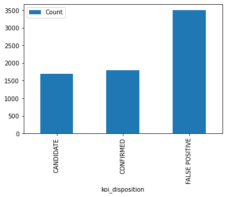

# Machine Learning - Exoplanet Exploration

Over a period of nine years in deep space, the NASA Kepler space telescope has been out on a planet-hunting mission to discover hidden planets outside of our solar system.

This project aims to build machine learning models to classify exoplanets from the raw dataset. 

I built two different machine learning models -Logistic Regression and Random Forest Classifier to classify the exoplanets. Find below a detailed summary of the process used to build these models and a detailed report about the two models' findings and performance comparison.

## Data Exploration
* Read the data from CSV file into a dataframe
* Cleaned the dataset by eliminating columns and rows containing null values
* Analysed the data features
* Checked data unbalance in target value, i.e., Class

