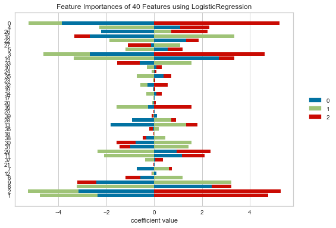

# Machine Learning - Exoplanet Exploration

Over a period of nine years in deep space, the NASA Kepler space telescope has been out on a planet-hunting mission to discover hidden planets outside of our solar system.

This project aims to build machine learning models to classify exoplanets from the raw dataset. 


I built two different machine learning models -Logistic Regression and Random Forest Classifier to classify the exoplanets. Find below a detailed summary of the process used to build these models and a detailed report about the two models' findings and performance comparison.

## Data Exploration
* Read the data from CSV file into a dataframe
* Cleaned the dataset by eliminating columns and rows containing null values
* Analysed the data features
* Checked data unbalance in target value, i.e., Class


## Model 1 - Logistic Regression
Followed the below process to create a Logistic Regression model that classified the exoplanets.

### Data Preprocessing
* Defined predictors and target values
* Used `MinMaxScaler` to scale the numerical data.

### Model Evaluation with all 40 features
* Separated the data into training and testing data.
* Trained the model and evaluated the model against test dataset.
* Used `GridSearch` to tune model parameters.
* Evaluated model performance
```
Training Data Score: 0.8897577722677856
Testing Data Score: 0.88558352402746
```
### Feature Selection

Used three methods for feature selection
1. Coefficient Value
2. Select From Model (SFM)
3. Recursive Feature Elimination (RFE)

#### Coefficient Value


#### Select From Model (SFM)
* Built Logistic Regression model using the top 17 features suggested by SFM method and evaluated the model performance.
* Used `GridSearch` to tune model parameters and Evaluated the model performance.
```
Training Data Score: 0.8844173183292008
Testing Data Score: 0.8792906178489702
```  

#### Recursive Feature Elimination (RFE)
* Built Logistic Regression model using the top 17 features suggested by RFE method and evaluated the model performance.
* Used `GridSearch` to tune model parameters and Evaluated the model performance.
```
Training Data Score: 0.8855617013160404
Testing Data Score: 0.8804347826086957
```  

## Model 2 - Random Forest Classifier
Followed the below process to create a Random Forest Classifier model that classified the exoplanets.

### Data Preprocessing
* Defined predictors and target values
* Used `MinMaxScaler` to scale the numerical data.

### Model Evaluation with all 40 features
* Separated the data into training and testing data.
* Trained the model and evaluated the model against test dataset.
* Used `GridSearch` to tune model parameters.
* Evaluated model performance
```
Training Data Score: 1.0
Testing Data Score: 0.9067505720823799
```

### Feature Selection

Used `feature_importances_` for feature selection
* Built Random Forest Classifier model using the top 17 features suggested by `feature_importances_`  and evaluated the model performance.
* Used `GridSearch` to tune model parameters and evaluated the model performance.
```
Training Data Score: 1.0
Testing Data Score: 0.8998855835240275
```  

# Conclusions

The Random Forest Classifier model's accuracy on test data was 0.899, while the accuracy of the Logistic Regression model on test data was 0.880. 

Random Forest Classifier model took 132 mins and 54 mins to train the model with 40 features and 17 features, respectively. The logistic Regression model was quite fast in training the model when compared to Random Forest Classifier model. 

The difference in accuracy is nominal compared to the amount of time required to train the models. So, the Logistic Regression model seems to be a better choice.

